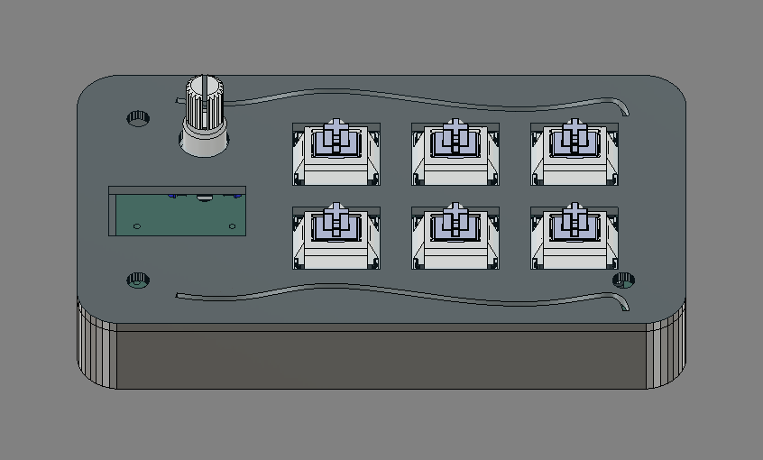
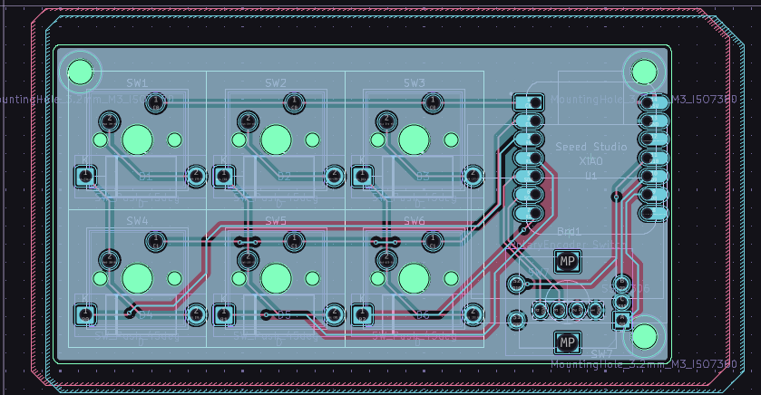
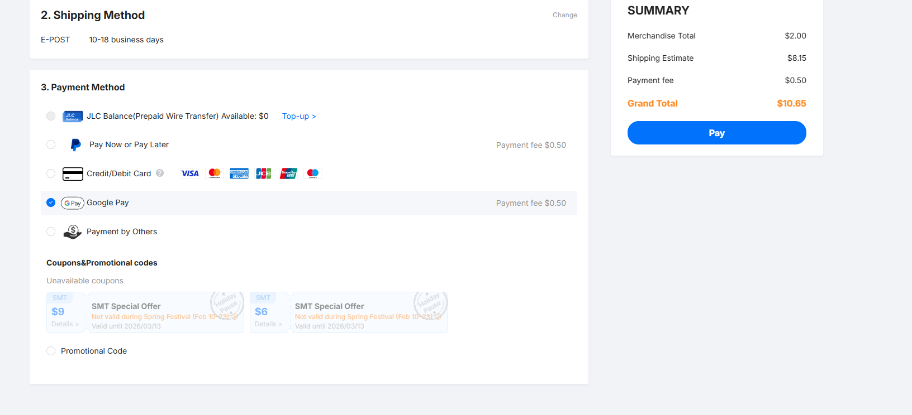
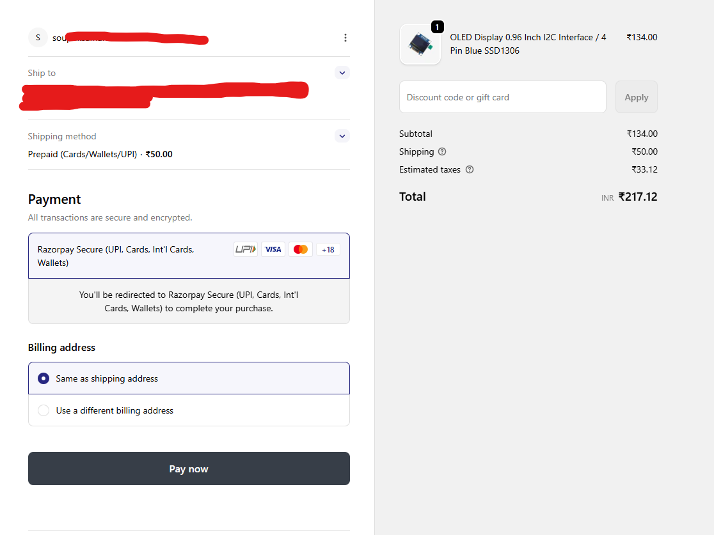
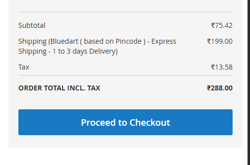
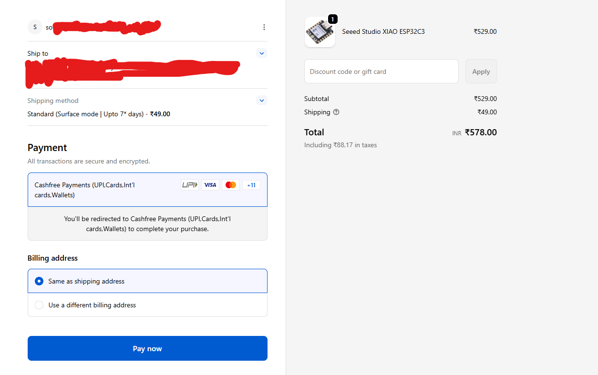

# SoupPad (SPV2)

> A custom mechanical macropad by Souptik — featuring 6 switches, a rotary encoder, an OLED display, and a Seeed Studio XIAOesp32 microcontroller.

---

## preview 

---

## Features

- 6 keys 
- 1 encoder 
- 1 oled 
- works on a xiaoesp32 and wifi keeb

---

### What You'll Need

- Custom PCB (order from JLCPCB, PCBWay, etc. using the gerbers)
- Seeed Studio XIAO esp32 **(note to who reviews this is custom project because it need esp32 and its a wifi keeb)**
- 6x MX-compatible switches
- 6x keycaps
- 1x rotary encoder + knob
- 1x small OLED screen
- 3D printed case (print the STL files)
- M3 screws and nuts
- USB-C cable

### Assembly Steps

1. Print the case using PLA 
2. solder the PCB — place switches, encoder, display, and XIAO
3. Flash the firmware onto the XIAO
4. Assemble — screw the PCB into the case
5. Plug in and configure your macros!

##  Macropad BOM

| Name | Link | Quantity | Unit Price | Vendor | Total |
|------|------|----------|------------|--------|--------|
| Keycaps (Numpad Set) | https://stackskb.com/store/numpad-keycaps/?attribute_variant=Blue+Gradient | 1 set | TBD | Stackskb | 35 USD |
| Cherry MX Clear (5-pin, pack of 10) | https://stackskb.com/store/cherry-mx-clear-switch-5-pin-pack-of-10/ | 1 pack | TBD | Stackskb | 35 USD |
| PCB | https://jlcpcb.com | 1 | $11 | JLCPCB | 35 USD |
| Case (3D printed) | N/A | 1 | $0.50 | Self | 35 USD |
| SSD1306 OLED (0.96” I2C) | https://quartzcomponents.com/products/oled-display-0-96-inch-i2c-interface-4-pin-blue-ssd1306 | 1 | ₹150 | Quartz Components | 35 USD |
| EC11 Rotary Encoder | https://probots.co.in/20-position-360-degree-rotary-encoder-ec11-w-push-button.html | 1 | ₹100 | Probots | 35 USD |
| Seeed XIAO ESP32C3 | https://robocraze.com/products/seeed-studio-xiao-esp32c3 | 1 | ₹600 | Robocraze | 35 USD |
| 1N4148 Diodes | https://www.electricallearner.in/product/1n4148-diode-500mw-100v-glass-diode/ | 1 pack | ₹100 | ElectricalLearner | 35 USD |
| Screws & Mounting Hardware (M3) | https://onlyscrews.in | 1 set | ₹267 | OnlyScrews | 35 USD |

Cat pics!
more like cart pics

> *SoupPad V2 — because i need a cool thing on my desk.*
